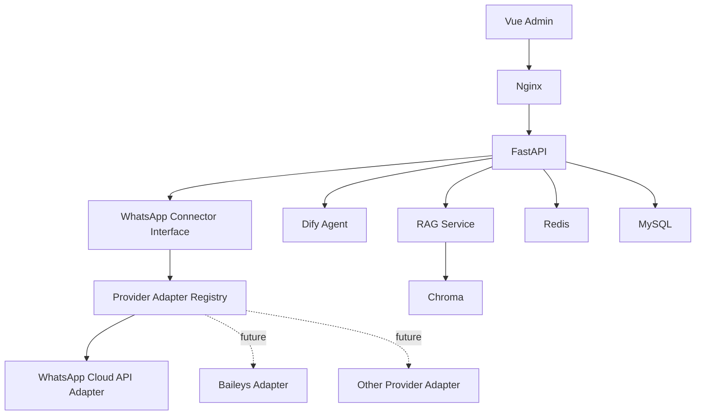

# OpenWA Cleanup Report

日期：2026-07-30

## 1. 删除的文件

- `.gitmodules`
- `scripts/init-openwa.sh`
- `backend/scripts/test_whatsapp_flow.py`
- `backend/tests/scripts/test_whatsapp_flow.py`
- `backend/tests/modules/test_conversation_whatsapp_delivery.py`

仓库审计时 `services/openwa` 目录并不存在，Git 索引中也没有对应 gitlink，因此没有
可删除的源码目录。额外清除了本地空目录 `.git/modules/services` 和残留的
`submodule.active` 配置；没有重新初始化 Git、改写历史或操作远端。

## 2. 修改的文件

### Docker 与环境

- `docker-compose.yml`
  - 移除 `openwa`、`openwa-init` 服务。
  - 移除 `openwa_data`、`openwa_runtime` 卷。
  - 移除专用 `connector_net`。
  - 移除 Backend 的运行时密钥文件注入、启动脚本包装和服务依赖。
  - 保留 Backend、Frontend、MySQL、Redis、Nginx、Chroma 和 Migration。
- `.env.example`
  - 删除所有 OpenWA 环境变量。
  - 保留 WhatsApp Graph API、Webhook 限制和处理超时配置。

### FastAPI 与 Connector

- 新增 `backend/app/connectors/whatsapp/provider.py`，定义 provider adapter 接口和注册表。
- 新增 `backend/app/connectors/whatsapp/providers/cloud_api.py`，实现 WhatsApp Cloud API
  健康检查、Webhook 验签/标准化、订阅 challenge 和文本发送。
- 重构 `client.py`、`service.py`、`webhook.py`、`schemas.py` 和 `repository.py`，
  使 FastAPI 业务只依赖统一 WhatsApp Connector 和 provider adapter。
- 更新 Connector 配置服务，使用 `phone_number_id`、`access_token`、`verify_token`
  和 `app_secret`，敏感字段继续加密保存。
- 更新 Conversation 发送链路，移除 provider runtime 直连，改由统一 adapter 发送。
- 删除 Settings 中所有 OpenWA 配置字段。

### 前端

- 删除 OpenWA Session、二维码、重连和轮询 API。
- WhatsApp 独立页面保留为 provider-neutral 管理入口，不再显示不存在的服务。
- Connector 管理页改为 WhatsApp Cloud API 凭据配置和连接测试。

### 文档与测试

- 重写 `README.md` 和 `docs/10-whatsapp-business-connector.md`。
- 用 Cloud API adapter 单元测试替换 provider runtime 测试。
- 更新 OpenAPI 和 Alembic 线性 head 断言。

## 3. 保留的功能

- WhatsApp Connector 业务入口、权限、配置加密和健康检查。
- Provider-neutral `BaseConnector` 与 `UnifiedMessageEnvelope` 协议。
- WhatsApp 入站消息、客户匹配、Conversation/Message 落库、幂等和脱敏日志。
- Dify Agent 自动回复链路。
- WhatsApp Cloud API 发送、Webhook 验签和订阅验证。
- 未来 Baileys 或其他 provider 可通过 `WhatsAppProviderAdapter` 接入。

## 4. 对 RAG 的影响

无影响。Chroma 服务、`CHROMA_*`、`RAG_*` 配置、知识库模块、文档解析和向量检索代码
均未修改。Compose 中 Chroma 服务、数据卷和 Backend 依赖保持不变。

## 5. 对 AI Agent 的影响

无架构性影响。Dify 配置、Agent Router/Service、AI 运行记录和对话流程均保留。
WhatsApp 入站消息仍会进入 Dify，回复通过 provider adapter 发出。

## 6. 对数据库的影响

- 保留 `connectors`、`connector_configs`、`whatsapp_sessions`、`customer_sessions`、
  `conversations`、`messages`、`webhook_logs` 和 `ai_agent_runs`。
- 没有删除历史 migration，也没有删除业务表或业务数据。
- 新增 migration `20260730_0007_provider_neutral_whatsapp.py`，仅把
  `session_id` 唯一约束改为 provider-neutral 名称。
- `whatsapp_sessions` 继续作为可供未来 provider 使用的渠道会话/账号状态表。
- 旧的 `session_id` 配置不会自动转换为 Cloud API 凭据；租户需要在管理页配置新的
  Cloud API 字段。

## 7. 对 Docker 部署的影响

Compose 当前只包含：

- `mysql`
- `redis`
- `chroma`
- `migration`
- `backend`
- `frontend`
- `nginx`

保留卷：`mysql_data`、`redis_data`、`chroma_data`。

保留网络：`edge_net`、`data_net`。Backend 仍能访问数据层，并通过 `edge_net`
访问外部 WhatsApp Graph API；Nginx、Frontend 和数据层拓扑未改变。

本机没有 Docker CLI，因此实际 `docker compose config` 命令已尝试但无法执行。
作为替代，已用 YAML 解析和结构化断言验证服务、依赖、build context、卷和网络。
正式部署前仍应在 Docker 主机执行一次 `docker compose config`。

## 8. 当前架构图

## 验证结果

- Ruff：通过。
- Backend Pytest：37 项通过。
- Vue TypeScript：通过。
- Vue production build：通过。
- YAML 解析和 Compose 结构断言：通过。
- Git submodule：无 `.gitmodules`、无 gitlink、无 `.git/modules`、无 submodule 配置。
- OpenWA 源码/配置引用：清理完成。排除 `.git` 后，最终文本搜索仅命中本报告中的
  审计记录和删除路径；不排除 `.git` 的原始递归搜索仍会命中历史 commit/reflog，
  因为本次清理按要求没有删除或改写历史。

## 重新部署结论

核心平台可以重新部署，但应满足以下前置条件：

1. 在目标 Docker 主机运行 `docker compose config` 并确认通过。
2. 备份 MySQL 后执行 Alembic upgrade。
3. 为需要 WhatsApp 的租户配置 Cloud API 凭据和新的 Connector-specific Webhook URL。
4. 在 Meta 后台完成 Webhook challenge 后执行 Connector 连接测试。

如果暂不使用 WhatsApp，Backend、Frontend、MySQL、Redis、Nginx、Dify 和 RAG
可以直接按现有 Compose 拓扑部署。
