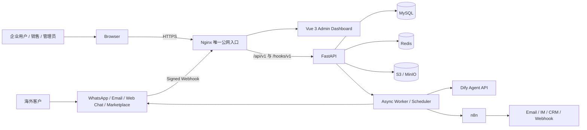

# 1. 总体架构

## 1.1 产品定位

AI Sales Agent Platform 是面向跨境企业的云端多租户 SaaS。企业成员通过浏览器完成渠道配置、客户管理、会话接管、知识库维护、意向跟进、报价与系统管理；客户从 WhatsApp、邮件、网站聊天、跨境电商平台等外部渠道发起询盘。

平台目标不是完全替代销售，而是自动完成可控的首轮响应、需求澄清、知识检索、线索评分与跟进提醒，并在风险、低置信度、高价值或报价审批场景中转人工。

## 1.2 架构原则

1. **单一公网入口**：Nginx 是唯一公网入口，浏览器不直接访问 FastAPI、Dify、n8n、MySQL 或 Redis。
2. **服务端持有密钥**：前端只获取展示所需数据和短期用户令牌，不获取 Dify API Key、渠道 Token、数据库密码或 webhook 签名密钥。
3. **多租户优先**：每个业务请求都携带由认证上下文解析出的租户，不接受前端自行声明可信 `tenant_id`。
4. **事务与自动化分离**：核心状态先在 MySQL 提交，再通过 Outbox 触发异步任务或 n8n；外部系统不参与数据库事务。
5. **可追溯 AI**：保存提示词版本、模型运行标识、知识引用、置信度、消耗、决策和人工接管原因。
6. **渠道适配隔离**：各渠道协议在 Connector Adapter 内完成，核心会话域只处理统一消息模型。
7. **默认安全与最小权限**：RBAC、资源级授权、配置加密、审计、限流、输入校验和日志脱敏默认启用。
8. **渐进扩展**：第一阶段以模块化单体和独立 Worker 落地；规模增长后可按领域拆分服务，无需先承担微服务复杂度。

## 1.3 系统上下文

说明：

- “后端 API 隐藏”指后端容器无公网端口、无独立公开域名，且由 Nginx 同源转发。浏览器业务请求仍可在网络面板中看到 `/api/v1`，这是 Web 应用的正常行为；安全边界不能依赖 URL 隐藏。
- 第三方渠道必须能够投递 webhook，因此仅开放受签名校验、幂等、限流和来源策略保护的 `/hooks/v1` 路径。
- 生产环境关闭 FastAPI `/docs`、`/redoc` 与 OpenAPI JSON 的公网访问。

## 1.4 逻辑分层

| 层 | 职责 | 关键约束 |
|---|---|---|
| Presentation | Vue 3、Element Plus、权限路由、管理后台 | 不保存服务密钥；不直连 Dify/n8n |
| Edge | TLS、静态资源、反向代理、限流、安全头、上传大小限制 | 唯一公网入口 |
| API/Application | 认证、用例编排、事务边界、输入输出 DTO | 不把 ORM 模型直接暴露为 API |
| Domain | 客户、会话、AI、RAG、报价、渠道、工作流、通知规则 | 与第三方 SDK 解耦 |
| Infrastructure | SQLAlchemy、Redis、对象存储、Dify/n8n/渠道适配器 | 可替换实现；统一超时与重试 |
| Async | 消息处理、知识同步、评分、通知、重试、定时任务 | 幂等；至少一次投递 |
| Data | MySQL 主数据、Redis 临时状态、对象存储原文件 | MySQL 是业务事实来源 |

## 1.5 后端领域模块

| 模块 | 核心职责 | 不应承担 |
|---|---|---|
| `auth` | 登录、令牌、RBAC、会话撤销、密码与 SSO 扩展点 | 业务数据授权逻辑的硬编码 |
| `customer` | 客户档案、来源、标签、负责人、意向阶段与评分快照 | 原始渠道协议解析 |
| `conversation` | 会话、消息时间线、人工接管、已读状态、统一消息模型 | 直接调用具体渠道 SDK |
| `ai_agent` | Agent 编排、Prompt 版本、上下文构造、响应审核、意向评分 | 存储 Dify Key 到前端 |
| `rag` | 文件上传、解析任务、Dify Dataset 同步、引用与状态 | 在 MySQL 内做向量检索 |
| `quotation` | 产品选择、报价草稿、版本、审批、导出状态 | 自动承诺不可授权的价格 |
| `connector` | 渠道配置、签名验证、消息标准化、发送适配、健康检查 | 客户/报价核心业务规则 |
| `workflow` | 工作流定义、触发条件、运行状态、n8n 映射 | 取代核心数据库事务 |
| `notification` | 站内通知、邮件/IM 通知、模板、投递状态 | 保存渠道明文密钥 |
| `system` | 租户配置、字典、审计、系统健康、功能开关 | 绕过租户隔离 |

横切基础模块包括 `core`、`db`、`cache`、`storage`、`observability`、`security` 和 `jobs`。

## 1.6 核心业务链路

### A. 客户入站询盘与 AI 自动回复

1. 渠道向 `/hooks/v1/connectors/{public_id}/events` 投递事件。
2. Connector 验签并用“连接器 + 外部事件 ID”判重，原始载荷脱敏后写入 `webhook_logs`。
3. 标准化为统一消息，解析或创建客户、客户会话、会话和消息。
4. 与 Outbox 事件在同一 MySQL 事务中提交，立即向渠道返回成功，避免 webhook 超时重投。
5. Worker 读取事件，检查黑名单、营业时间、人工接管状态、AI 开关和速率限制。
6. AI Orchestrator 组合租户策略、客户信息、最近消息和 Prompt 版本，请求 Dify Agent API。
7. 对结果执行安全策略、引用完整性、禁用承诺、敏感数据和置信度检查。
8. 通过 Connector 发送回复，保存发送尝试、渠道消息 ID、Dify 运行 ID、引用和 Token/成本元数据。
9. 失败按指数退避重试；超过阈值进入死信并通知管理员。

### B. AI 主动澄清需求

AI 输出结构化槽位，例如产品、数量、目标市场、交付时间、预算、贸易条款。后端依据租户定义的“必填需求字段”计算缺口，每轮只追问优先级最高的少量字段；达到最大轮次、客户拒答或出现高风险内容时停止并转人工。

### C. 意向评分与销售通知

评分由可解释规则与 AI 评估共同构成，建议默认维度为需求明确度、采购数量、预算匹配、时间紧迫度、互动质量和客户画像。保存总分、分项分数、模型/规则版本与解释；跨越租户阈值时生成通知并触发 n8n，而不是每条消息重复通知。

### D. AI 报价辅助

AI 只能根据结构化产品、价目规则和客户需求生成报价建议与说明。正式报价由后端重新计算金额、税费、折扣和币种精度；超过折扣权限或金额阈值进入审批。AI 文本不得成为金额事实来源。

### E. 知识库同步

1. 前端申请上传并将文件上传到对象存储。
2. 后端登记 `knowledge_files`，异步进行病毒扫描、格式校验和文本抽取。
3. 文件/分块同步到 Dify Dataset，MySQL 保存外部 Dataset/Document/Segment ID、摘要、哈希和同步状态。
4. 文件更新按内容哈希幂等处理；删除先标记，再异步删除 Dify 资源与对象。
5. 回答保存引用的知识文件、分块和 Dify 检索元数据，支持审计。

## 1.7 AI 与自动化边界

### Dify

- 仅由后端 Worker 或 API 服务调用。
- 每租户可映射独立 Dify App/Dataset；若共享 App，必须在后端强制数据集和租户过滤。
- 使用结构化输出约束回复、需求槽位、评分和下一动作。
- 配置连接/读取总超时、重试、熔断和并发配额。
- Prompt 发布采用版本化与灰度策略；生产会话引用不可变版本。
- 低置信度、无可靠引用、价格承诺、合规关键词和客户明确要求人工时强制接管。

### n8n

- 通过内网 webhook 或队列触发，使用服务身份签名。
- 适用于 CRM 同步、邮件/IM 通知、周期性跟进和非核心数据搬运。
- n8n 只接收完成任务所需的最少字段；敏感字段需脱敏。
- 工作流运行结果回写平台，平台仍是客户、消息、报价和权限的事实来源。

## 1.8 多租户与权限

- `tenants` 是隔离根；用户、角色、客户、会话、配置、连接器、知识和报价均归属租户。
- API 从已验证的用户会话解析 `tenant_id`，Repository 查询默认注入租户条件。
- 角色建议：`tenant_owner`、`admin`、`sales_manager`、`sales_rep`、`knowledge_manager`、`auditor`。
- 除 RBAC 外增加资源级规则，例如销售只能查看本人/团队客户，知识管理员不能审批折扣。
- 超级管理员能力与租户后台物理/逻辑分离，所有跨租户操作强制记录审计原因。

## 1.9 安全设计

- TLS 1.2+；HSTS、CSP、`X-Content-Type-Options`、`Referrer-Policy`。
- 推荐短期 Access Token 仅保存在内存；Refresh Token 通过 `HttpOnly + Secure + SameSite` Cookie 传输，并采用轮换与复用检测。若采用纯 Cookie 会话，则所有写接口加 CSRF 防护。
- 密码使用 Argon2id；登录、验证码、webhook、AI 调用和文件上传分别限流。
- Connector 密钥采用信封加密；数据库只存密文与密钥版本，主密钥从部署 Secret 注入。
- `.env` 仅作为单机 Compose 的注入入口，不提交仓库；生产优先 Docker Secrets/云 Secret Manager。
- 日志禁止记录 Authorization、Cookie、Dify Key、完整渠道 Token、密码和未脱敏 webhook 载荷。
- 上传文件校验 MIME、扩展名、大小、哈希并进行恶意文件扫描；下载使用短期签名 URL。
- 审计登录、权限、连接器密钥、Prompt、知识文件、报价审批、系统配置和数据导出。

## 1.10 可靠性与一致性

- webhook 使用 Inbox 幂等键；外发与自动化使用 Outbox，投递语义为“至少一次”，消费者必须幂等。
- 消息按 `conversation_id + sequence_no` 保序；同一会话使用 Redis 短锁或队列分区串行处理。
- 外部调用统一设置超时、指数退避、最大尝试次数、熔断和死信。
- 客户与消息写入成功不依赖 Dify/n8n/渠道在线。
- Redis 丢失不得导致业务数据丢失；缓存可重建，关键状态落 MySQL。
- 所有时间以 UTC 存储，前端按租户时区显示；金额使用 `DECIMAL`，不得使用浮点数。

## 1.11 可观测性

- 每个请求和异步任务携带 `trace_id`、`request_id`、`tenant_id`（日志中可哈希）和业务资源 ID。
- 结构化 JSON 日志；指标覆盖请求延迟/错误率、webhook 积压、队列延迟、AI 成功率/延迟/成本、消息发送失败、知识同步失败。
- 健康检查分为进程存活 `/health/live` 与依赖就绪 `/health/ready`，只在内网或受保护路径开放。
- 告警至少覆盖：5xx、队列积压、Dify 熔断、MySQL/Redis 不健康、磁盘水位、备份失败、webhook 签名异常峰值。

## 1.12 建议的首期 SLO

| 指标 | 建议目标 |
|---|---|
| 管理台/API 月可用性 | 99.9% |
| 已验签 webhook 持久化 | P95 < 500 ms |
| 普通 API 响应（不含导出/AI） | P95 < 300 ms |
| AI 首次回复 | P95 < 15 s，超时转异步/人工 |
| 消息数据持久性 | 已确认写入后不丢失 |
| RPO / RTO | ≤ 15 min / ≤ 60 min（首期单区域） |

## 1.13 演进路线

- **阶段 1**：单机 Docker Compose、模块化单体、独立 Worker、外部 Dify，适合试点与中小规模生产。
- **阶段 2**：托管 MySQL/Redis/S3，多实例 API/Worker，独立消息队列，可观测平台与集中 Secret Manager。
- **阶段 3**：Kubernetes、多可用区、按 Connector/AI/RAG 拆分服务、事件总线、租户配额与跨区域灾备。

Docker Compose 本身不是多可用区高可用方案；本设计通过清晰边界保证后续迁移，而不把单机部署包装成“无限扩展”。

