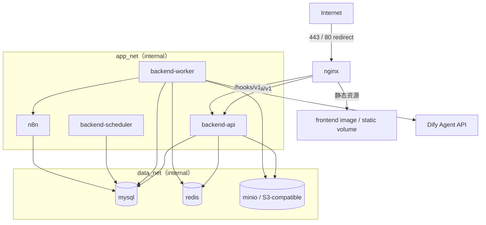

# 3. Docker Compose 部署方案

## 3.1 目标拓扑



生产服务器仅映射 Nginx 的 `80/443`。MySQL、Redis、MinIO、n8n 和 FastAPI 只使用 Docker 内部网络；如需管理，使用 VPN、SSH 隧道或受控运维网络，不直接暴露端口。

## 3.2 服务清单

| 服务 | 作用 | 公网端口 | 持久化 |
|---|---|---:|---|
| `nginx` | TLS、前端、反向代理、限流、安全头 | 80/443 | 证书/日志 |
| `frontend` | 多阶段构建 Vue 静态文件 | 无 | 无 |
| `backend-api` | FastAPI HTTP API 与 webhook 接收 | 无 | 无 |
| `backend-worker` | AI、发送、RAG、通知、Outbox 任务 | 无 | 无 |
| `backend-scheduler` | 超时回收、重试、定时跟进 | 无 | 无 |
| `mysql` | 业务事实数据 | 无 | `mysql_data` |
| `redis` | 缓存、限流、锁、短期队列状态 | 无 | `redis_data` |
| `minio` | 本地部署时的知识文件对象存储 | 无 | `object_data` |
| `n8n` | 自动化工作流执行 | 无 | `n8n_data` |
| `migration` | 一次性 Alembic 升级任务 | 无 | 无 |

说明：生产可把 MySQL、Redis 和对象存储替换成云托管服务；Compose 保留相同环境变量契约。

## 3.3 Compose 文件策略

- `compose.base.yml`：服务、网络、卷、健康检查的公共定义。
- `compose.dev.yml`：源码挂载、热更新、开发端口、Mailpit 等，仅本地使用。
- `compose.prod.yml`：不可变镜像、资源限制、只读文件系统、日志轮转、重启策略。
- 根 `compose.yml`：生产默认入口或显式 include，避免部署人员误用开发配置。
- 可选 Profile：`storage-local` 启用 MinIO，`automation` 启用 n8n，`observability` 启用指标与日志组件。

镜像使用固定版本或 digest，不使用浮动 `latest`。API、Worker 和 Scheduler 使用同一后端镜像，以不同启动命令运行。

## 3.4 网络隔离

| 网络 | 成员 | 规则 |
|---|---|---|
| `edge_net` | nginx、frontend/backend-api | 只有 Nginx 可连接 API |
| `app_net` | API、Worker、Scheduler、n8n | `internal: true` |
| `data_net` | API/Worker/Scheduler 与数据服务 | `internal: true`，最小成员集 |

若 n8n 不需要直接访问 MySQL，则不加入 `data_net`，只通过签名的内部 API 回写结果。推荐此模式。

## 3.5 Nginx 路由

| 公网路径 | 上游 | 关键控制 |
|---|---|---|
| `/` | Vue 静态文件 | SPA fallback、缓存带 hash 的资产 |
| `/api/v1/` | `backend-api:8000` | 同源、鉴权、通用限流、请求 ID |
| `/hooks/v1/` | `backend-api:8000` | 独立限流、请求体上限、原始请求体保留验签 |
| `/ws/` | `backend-api:8000` | 可选 WebSocket/SSE、长连接超时 |
| `/healthz` | Nginx 自身 | 仅负载均衡器/运维网可访问 |

生产不代理 `/docs`、`/redoc`、`/openapi.json`、n8n 编辑器或 MinIO Console。前端路由 fallback 仅用于页面路径，不得吞掉 `/api` 和 `/hooks` 的 404。

## 3.6 环境变量与 Secret 分组

根 `.env.example` 只提供变量名和无敏感示例，不放可用凭据。

```text
# Platform
APP_ENV
APP_VERSION
PUBLIC_BASE_URL
DEFAULT_TIMEZONE

# MySQL
MYSQL_HOST
MYSQL_PORT
MYSQL_DATABASE
MYSQL_USER
MYSQL_PASSWORD
MYSQL_ROOT_PASSWORD

# Redis
REDIS_URL
REDIS_PASSWORD

# Auth / encryption
JWT_PRIVATE_KEY_FILE
JWT_PUBLIC_KEY_FILE
TOKEN_PEPPER
CONFIG_ENCRYPTION_KEY

# Dify (server-side only)
DIFY_API_BASE_URL
DIFY_API_KEY
DIFY_TIMEOUT_SECONDS

# n8n (server-side only)
N8N_INTERNAL_URL
N8N_WEBHOOK_SECRET
N8N_ENCRYPTION_KEY

# Object storage
S3_ENDPOINT
S3_REGION
S3_BUCKET
S3_ACCESS_KEY
S3_SECRET_KEY

# Observability
LOG_LEVEL
OTEL_EXPORTER_OTLP_ENDPOINT
SENTRY_DSN
```

前端构建参数只允许：

```text
VITE_APP_TITLE
VITE_API_BASE=/api/v1
VITE_SENTRY_PUBLIC_DSN
```

生产推荐把密码、私钥和 API Key 以 Docker Secret 文件或云 Secret Manager 注入；应用支持 `*_FILE` 形式读取。`.env` 权限至少限制为部署用户可读，并纳入轮换流程。

## 3.7 启动与发布顺序

1. 校验环境变量完整性、目录权限、证书和镜像签名/摘要。
2. 启动 MySQL、Redis、对象存储，等待健康检查通过。
3. 运行一次性 `migration` 容器；迁移失败立即终止发布。
4. 启动 API、Worker、Scheduler 和 n8n。
5. 通过内部 readiness 检查验证依赖。
6. 启动或重载 Nginx，再执行登录、webhook 幂等和 AI 降级烟雾测试。
7. 发布后观察错误率、队列积压和慢查询，再清理旧镜像。

数据库迁移遵循 Expand/Contract：先增加兼容字段/表，部署兼容代码，完成回填后再在后续版本删除旧结构，避免不可回滚迁移。

## 3.8 健康检查与重启

- 容器进程检查与依赖就绪检查分开。
- `backend-api` readiness 检查 MySQL 可连接和必要配置，Dify/n8n 不可用只标记依赖降级，不应阻止查看已有客户数据。
- Worker 定期更新 heartbeat；Scheduler 使用分布式租约避免多实例重复执行。
- `restart: unless-stopped` 仅用于长期服务；迁移任务使用 `restart: "no"`。
- 设置 CPU/内存限制、PIDs 限制、`no-new-privileges`，可行时使用非 root 和只读根文件系统。

## 3.9 备份与灾难恢复

- MySQL：每日全量 + binlog 增量，备份加密并复制到异地对象存储。
- 对象存储：启用版本化/生命周期；知识原文件与数据库映射必须一致备份。
- n8n：备份数据库/卷和加密密钥；丢失 `N8N_ENCRYPTION_KEY` 会导致凭据不可恢复。
- Redis：不是唯一事实来源；可开启 AOF 以降低任务恢复成本，但不能替代 MySQL/Outbox。
- 每季度执行恢复演练，记录实际 RPO/RTO；仅“备份成功”不足以证明可恢复。

## 3.10 容量与扩展

- API 和 Worker 保持无状态，可横向扩容；文件不写容器本地磁盘。
- Worker 按 `ai`、`connector-send`、`rag`、`notification` 队列独立配置并发与限额。
- MySQL 索引按租户和时间设计，历史消息/审计日志可按月归档或分区。
- Redis 内存设置上限与淘汰策略；幂等键和缓存均设置明确 TTL。
- 超出单机边界后，优先迁移托管数据服务与独立消息队列，再迁移到容器编排平台。

