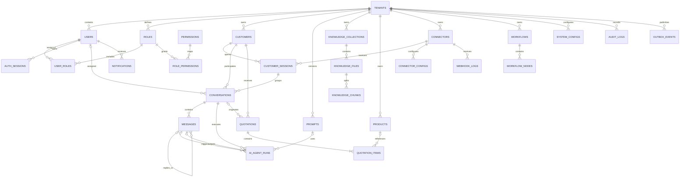

# 4. MySQL ER 设计

## 4.1 设计基线

- MySQL 8.0，字符集 `utf8mb4`，排序规则建议 `utf8mb4_0900_ai_ci`。
- 表名和字段名使用 `snake_case`；所有时间存 UTC `DATETIME(6)`。
- 内部主键使用 `BIGINT UNSIGNED`，对外资源 ID 使用不可枚举的 `public_id CHAR(26)`（ULID）。
- 金额使用 `DECIMAL(19,4)`，币种使用 ISO 4217 `CHAR(3)`。
- 业务表包含 `tenant_id`；唯一约束通常以 `tenant_id` 开头。
- 软删除表使用 `deleted_at`，普通查询默认排除；审计/日志表不允许业务软删除。
- JSON 只保存变化较大、无需强关系约束的配置或快照；关键查询字段必须结构化。
- 密钥配置只保存密文或 Secret 引用，不保存明文。

用户指定的 20 张表全部保留。为达到企业级多租户、RBAC、AI 可追溯、报价明细和可靠事件投递要求，增加 8 张必要支撑表：`tenants`、`user_roles`、`role_permissions`、`auth_sessions`、`ai_agent_runs`、`knowledge_collections`、`quotation_items`、`outbox_events`。当前基线共 28 张表。

## 4.2 核心 ER 图

## 4.3 身份、租户与 RBAC

### `tenants`（新增）

| 字段 | 类型 | 约束/说明 |
|---|---|---|
| `id` | BIGINT UNSIGNED | PK |
| `public_id` | CHAR(26) | UQ，对外 ID |
| `name` | VARCHAR(160) | 企业名称 |
| `slug` | VARCHAR(80) | UQ，租户标识 |
| `status` | VARCHAR(24) | `active/suspended/closed` |
| `plan_code` | VARCHAR(50) | 套餐 |
| `timezone` | VARCHAR(64) | IANA 时区 |
| `default_currency` | CHAR(3) | 默认币种 |
| `data_region` | VARCHAR(32) | 数据区域 |
| `created_at/updated_at/deleted_at` | DATETIME(6) | 生命周期 |

索引：`uq_tenants_public_id`、`uq_tenants_slug`、`idx_tenants_status`。

### `users`

| 字段 | 类型 | 约束/说明 |
|---|---|---|
| `id/public_id` | BIGINT / CHAR(26) | PK / UQ |
| `tenant_id` | BIGINT UNSIGNED | FK tenants |
| `email` | VARCHAR(254) | 租户内唯一，规范化保存 |
| `password_hash` | VARCHAR(255) | Argon2id；SSO 用户可空 |
| `display_name` | VARCHAR(120) | 展示名 |
| `status` | VARCHAR(24) | `invited/active/locked/disabled` |
| `locale/timezone` | VARCHAR(16)/VARCHAR(64) | 偏好 |
| `mfa_enabled` | BOOLEAN | MFA 状态 |
| `last_login_at` | DATETIME(6) | 最后登录 |
| `created_at/updated_at/deleted_at` | DATETIME(6) | 生命周期 |

索引：`uq_users_tenant_email(tenant_id,email)`、`idx_users_tenant_status`。

### `roles`

字段：`id`、`public_id`、`tenant_id`、`code`、`name`、`description`、`is_system`、`created_at`、`updated_at`。  
约束：`uq_roles_tenant_code(tenant_id,code)`；系统角色禁止租户管理员删除。

### `permissions`

字段：`id`、`code`、`resource`、`action`、`description`、`created_at`。  
约束：`code` 全局唯一，例如 `customer.read_team`、`quotation.approve`。

### `user_roles`（新增）

字段：`user_id`、`role_id`、`assigned_by`、`created_at`。  
主键：`(user_id, role_id)`；应用层和迁移校验用户与角色属于同一租户。

### `role_permissions`（新增）

字段：`role_id`、`permission_id`、`created_at`。  
主键：`(role_id, permission_id)`。

### `auth_sessions`（新增）

字段：`id`、`public_id`、`tenant_id`、`user_id`、`refresh_token_hash`、`token_family_id`、`ip_hash`、`user_agent_hash`、`expires_at`、`last_used_at`、`revoked_at`、`revoke_reason`、`created_at`。  
用途：Refresh Token 轮换、设备会话管理与复用检测；不保存原始 Token。

## 4.4 客户与会话

### `customers`

字段：

- 标识：`id`、`public_id`、`tenant_id`
- 档案：`name`、`company_name`、`email`、`phone_e164`、`country_code`、`language`
- 销售：`lifecycle_stage`、`intent_score DECIMAL(5,2)`、`intent_level`、`score_explanation JSON`
- 来源：`source_type`、`source_ref`、`tags JSON`
- 归属：`owner_user_id`、`created_by`
- 合规：`consent_status`、`do_not_contact`、`last_contact_at`
- 生命周期：`created_at`、`updated_at`、`deleted_at`

索引：`idx_customers_tenant_owner_stage`、`idx_customers_tenant_score`、`idx_customers_tenant_email`、`idx_customers_tenant_phone`。邮箱/电话不强制全局唯一，以支持共享联系人和历史导入；合并客户走显式流程。

### `customer_sessions`

表示客户在某连接器/外部账号中的连续联系上下文。

字段：`id`、`public_id`、`tenant_id`、`customer_id`、`connector_id`、`external_contact_id`、`external_thread_id`、`status`、`first_seen_at`、`last_seen_at`、`metadata JSON`、`created_at`、`updated_at`。  
约束：`uq_customer_sessions_external(tenant_id,connector_id,external_contact_id,external_thread_id)`。

### `conversations`

表示平台可分配、可接管的业务会话。

字段：`id`、`public_id`、`tenant_id`、`customer_id`、`customer_session_id`、`subject`、`status`、`mode` (`ai/assisted/human`)、`assigned_user_id`、`priority`、`unread_count`、`ai_enabled`、`handoff_reason`、`last_message_at`、`closed_at`、`version`、`created_at`、`updated_at`。  
索引：`idx_conversations_tenant_assignee_status`、`idx_conversations_tenant_last_message`、`idx_conversations_customer`。

### `messages`

字段：

- `id`、`public_id`、`tenant_id`、`conversation_id`
- `sequence_no`、`direction` (`inbound/outbound/internal`)
- `sender_type` (`customer/ai/user/system`) 与 `sender_ref`
- `message_type` (`text/image/file/audio/template/event`)
- `content_text`、`content_json`、`reply_to_message_id`
- `external_message_id`、`idempotency_key`
- `status` (`received/queued/sent/delivered/read/failed`)
- `ai_run_id`、`prompt_id`、`citations JSON`、`token_usage JSON`
- `error_code`、`sent_at`、`delivered_at`、`read_at`、`created_at`

约束/索引：`uq_messages_conversation_seq(conversation_id,sequence_no)`、`uq_messages_tenant_idempotency(tenant_id,idempotency_key)`、`idx_messages_conversation_created`、`idx_messages_external`。大文本后期可分离归档。

## 4.5 AI Prompt、AI 会话与知识库

### `prompts`

字段：`id`、`public_id`、`tenant_id`、`prompt_key`、`name`、`version`、`purpose`、`content`、`variables_schema JSON`、`output_schema JSON`、`status` (`draft/published/retired`)、`dify_app_id`、`created_by`、`published_by`、`published_at`、`created_at`、`updated_at`。  
约束：`uq_prompts_tenant_key_version(tenant_id,prompt_key,version)`；已发布版本不可原地修改。

### `ai_agent_runs`（新增）

每一次 Dify Agent 执行对应一条不可覆盖的运行记录，用于串联平台会话、触发消息、AI 输出消息和 Prompt 版本。

字段：

- 关系：`tenant_id`、`conversation_id`、`trigger_message_id`、`output_message_id`、`prompt_id`
- 上游映射：`dify_conversation_id`、`dify_task_id`、`model_name`
- 状态：`run_type`、`status`、`started_at`、`completed_at`、`latency_ms`
- 可追溯数据：`input_redacted`、`output_redacted`、`extracted_needs`、`citations`、`policy_result`
- 计量：`prompt_tokens`、`completion_tokens`、`cost_amount`、`cost_currency`
- 结果：`intent_score`、`error_code`、`error_message`
- 生命周期：`id`、`public_id`、`created_at`、`updated_at`

索引：会话时间线、租户状态时间线和 `dify_task_id`。输入输出必须先脱敏；原始密钥、Authorization Header 和完整上游请求不得落库。

### `knowledge_collections`（新增）

字段：`id`、`public_id`、`tenant_id`、`name`、`description`、`dify_dataset_id`、`embedding_provider`、`status`、`created_by`、`created_at`、`updated_at`、`deleted_at`。  
用途：隔离产品线/语言/业务场景及其 Dify Dataset 映射。

### `knowledge_files`

字段：`id`、`public_id`、`tenant_id`、`collection_id`、`original_name`、`object_key`、`mime_type`、`size_bytes`、`sha256`、`language`、`status` (`uploaded/scanning/parsing/syncing/ready/failed/deleting`)、`dify_document_id`、`version`、`error_message`、`uploaded_by`、`processed_at`、`created_at`、`updated_at`、`deleted_at`。  
约束：`uq_knowledge_files_collection_hash(collection_id,sha256,deleted_at)` 需结合应用幂等处理；索引同步状态和创建时间。

### `knowledge_chunks`

字段：`id`、`public_id`、`tenant_id`、`knowledge_file_id`、`chunk_index`、`content_text MEDIUMTEXT`、`content_hash`、`token_count`、`metadata JSON`、`dify_segment_id`、`sync_status`、`created_at`、`updated_at`。  
约束：`uq_chunks_file_index(knowledge_file_id,chunk_index)`。本表用于追溯、展示和同步，不作为向量检索引擎。

## 4.6 产品与报价

### `products`

字段：`id`、`public_id`、`tenant_id`、`sku`、`name`、`description`、`category`、`unit`、`currency`、`base_price DECIMAL(19,4)`、`min_order_qty DECIMAL(19,4)`、`attributes JSON`、`status`、`created_at`、`updated_at`、`deleted_at`。  
约束：`uq_products_tenant_sku(tenant_id,sku)`。

### `quotations`

字段：`id`、`public_id`、`tenant_id`、`quotation_no`、`customer_id`、`conversation_id`、`version`、`status` (`draft/pending_approval/approved/sent/accepted/rejected/expired/cancelled`)、`currency`、`subtotal`、`discount_amount`、`tax_amount`、`shipping_amount`、`total_amount`、`valid_until`、`incoterm`、`payment_terms`、`notes`、`ai_suggestion JSON`、`created_by`、`approved_by`、`approved_at`、`sent_at`、`created_at`、`updated_at`。  
约束：`uq_quotations_tenant_no(tenant_id,quotation_no)`；状态变更使用乐观锁或版本条件更新。

### `quotation_items`（新增）

字段：`id`、`quotation_id`、`product_id`（可空，允许临时报价项）、`sku_snapshot`、`name_snapshot`、`description`、`quantity DECIMAL(19,4)`、`unit`、`unit_price`、`discount_rate DECIMAL(7,4)`、`tax_rate DECIMAL(7,4)`、`line_total`、`sort_order`、`created_at`、`updated_at`。  
报价项保存快照，产品后续改名/改价不影响历史报价。

## 4.7 渠道接入

### `connectors`

字段：`id`、`public_id`、`tenant_id`、`provider`、`name`、`status`、`capabilities JSON`、`external_account_id`、`health_status`、`last_health_check_at`、`created_by`、`created_at`、`updated_at`、`deleted_at`。  
约束：`uq_connectors_tenant_provider_account(tenant_id,provider,external_account_id)`。

### `connector_configs`

字段：`id`、`tenant_id`、`connector_id`、`config_key`、`value_type`、`value_encrypted MEDIUMBLOB`、`secret_ref`、`key_version`、`is_secret`、`updated_by`、`created_at`、`updated_at`。  
约束：`uq_connector_configs_key(connector_id,config_key)`。普通配置也可进入加密列，API 永不返回 Secret 原值。

### `webhook_logs`

字段：`id`、`public_id`、`tenant_id`、`connector_id`、`provider_event_id`、`event_type`、`signature_valid`、`headers_redacted JSON`、`payload_redacted JSON`、`payload_hash`、`status` (`received/processed/ignored/failed/dead_letter`)、`attempt_count`、`next_retry_at`、`processed_at`、`error_code`、`trace_id`、`received_at`。  
约束：`uq_webhook_connector_event(connector_id,provider_event_id)`；若渠道无事件 ID，使用稳定的 `payload_hash` 幂等窗口。

## 4.8 工作流、通知与系统

### `workflows`

字段：`id`、`public_id`、`tenant_id`、`name`、`trigger_type`、`status`、`version`、`definition JSON`、`n8n_workflow_id`、`last_published_at`、`created_by`、`updated_by`、`created_at`、`updated_at`、`deleted_at`。  
约束：`uq_workflows_tenant_name_version(tenant_id,name,version)`。

### `workflow_nodes`

字段：`id`、`public_id`、`tenant_id`、`workflow_id`、`node_key`、`node_type`、`name`、`config JSON`、`position JSON`、`sort_order`、`created_at`、`updated_at`。  
约束：`uq_workflow_nodes_key(workflow_id,node_key)`。敏感配置只能引用 Secret，不能直接放 `config`。

### `notifications`

字段：`id`、`public_id`、`tenant_id`、`user_id`、`type`、`channel`、`title`、`content`、`resource_type`、`resource_public_id`、`priority`、`status`、`dedupe_key`、`read_at`、`sent_at`、`failed_at`、`error_code`、`created_at`。  
约束：`uq_notifications_tenant_dedupe(tenant_id,dedupe_key)`；索引用户未读和创建时间。

### `system_configs`

字段：`id`、`tenant_id`、`config_key`、`value_json`、`value_encrypted`、`is_secret`、`version`、`description`、`updated_by`、`created_at`、`updated_at`。  
约束：`uq_system_configs_tenant_key(tenant_id,config_key)`；Secret 类型读取 API 仅返回 `configured: true/false`。

### `audit_logs`

字段：`id`、`public_id`、`tenant_id`、`actor_type`、`actor_id`、`action`、`resource_type`、`resource_id`、`result`、`reason`、`changes_redacted JSON`、`ip_hash`、`user_agent_hash`、`request_id`、`trace_id`、`created_at`。  
索引：`idx_audit_tenant_created`、`idx_audit_resource`、`idx_audit_actor`。仅追加，禁止 UPDATE/DELETE；按保留策略归档。

### `outbox_events`（新增）

字段：`id`、`public_id`、`tenant_id`、`aggregate_type`、`aggregate_id`、`event_type`、`payload JSON`、`status` (`pending/processing/published/failed/dead_letter`)、`attempt_count`、`available_at`、`locked_at`、`locked_by`、`published_at`、`last_error`、`created_at`。  
索引：`idx_outbox_dispatch(status,available_at,id)`、`idx_outbox_aggregate`。与业务变更同事务写入。

## 4.9 数据隔离与完整性

1. 所有外键在数据库层启用；跨租户一致性由 Repository 条件、服务校验和集成测试共同保证。
2. 任何按 `public_id` 查询都必须同时带认证上下文中的 `tenant_id`。
3. 后台列表索引以 `tenant_id` 为第一列，再按常用过滤字段和排序字段组合。
4. 删除客户前需处理法律保留、报价与审计引用；默认匿名化个人信息，不物理删除审计事实。
5. webhook、消息、Outbox 和通知均有幂等键；重试不能产生重复消息、重复报价或重复提醒。
6. 超大消息、审计和 webhook 表制定按月归档策略；是否采用 MySQL 分区在有实际容量数据后决定。

## 4.10 状态机约束

- 会话：`open -> pending -> closed`，任意活动状态可 `blocked`；关闭后新消息可创建新会话或显式 reopen。
- 消息：`received/queued -> sent -> delivered -> read`，发送路径可进入 `failed` 并重试。
- 报价：`draft -> pending_approval -> approved -> sent -> accepted/rejected/expired`，取消进入 `cancelled`。
- 知识文件：`uploaded -> scanning -> parsing -> syncing -> ready`，任一步可进入 `failed`，删除进入 `deleting`。
- AI 运行：`queued -> running -> succeeded/failed/timed_out/cancelled`，终态记录不可原地重跑；重试创建新运行并通过 trace/correlation ID 关联。

状态流转必须通过领域服务执行并写审计，禁止通用 PATCH 任意修改状态字段。
