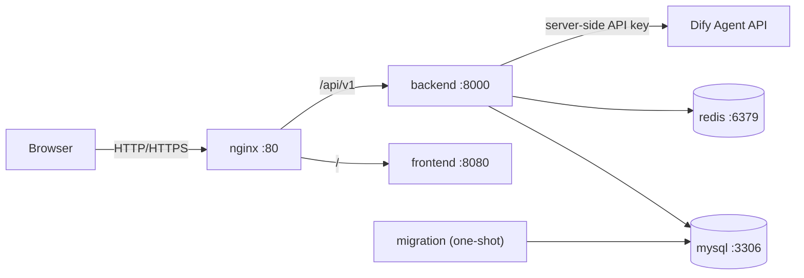

# 云端 Docker Compose 部署

本文档适用于单台云服务器或私有云虚拟机部署。浏览器只访问 Nginx 暴露的 HTTP
入口；Frontend、FastAPI、MySQL 和 Redis 均不映射公网端口。

## 1. 服务拓扑



`nginx` 是唯一公开服务。`backend` 只加入容器内部网络，Dify API Key、数据库密码、
JWT 密钥和 Connector 加密密钥不会进入前端镜像。

## 2. 服务器要求

- Linux x86_64/arm64 云服务器
- Docker Engine 24+ 和 Docker Compose v2
- 建议至少 2 vCPU、4 GB RAM、20 GB 可用磁盘
- 防火墙只开放 80/443；SSH 应限制来源地址
- 生产域名的 TLS 建议在云负载均衡/CDN终止，或另行挂载证书到 Nginx

## 3. 首次配置

在项目根目录执行：

```bash
cp .env.example .env
chmod 600 .env
```

Windows PowerShell：

```powershell
Copy-Item .env.example .env
```

然后编辑 `.env`，至少替换：

- `MYSQL_PASSWORD`
- `MYSQL_ROOT_PASSWORD`
- `DATABASE_URL` 中的数据库密码
- `REDIS_PASSWORD`
- `REDIS_URL` 中的 Redis 密码
- `JWT_SECRET`
- `CONFIG_ENCRYPTION_KEY`
- `DIFY_API_KEY`
- `CORS_ORIGINS`

生成 JWT 密钥：

```bash
openssl rand -hex 32
```

生成 Connector 配置加密密钥：

```bash
openssl rand -base64 32 | tr '+/' '-_' | tr -d '='
```

如果密码包含 `@`、`:`、`/`、`?` 或 `#`，必须先做 URL 编码，再填写到
`DATABASE_URL` 或 `REDIS_URL`。

## 4. 启动系统

校验最终配置：

```bash
docker compose config --quiet
```

构建并后台启动全部服务：

```bash
docker compose up -d
```

Compose 会按以下顺序启动：

1. MySQL、Redis 启动并通过健康检查。
2. `migration` 一次性容器执行 `alembic upgrade head`。
3. 迁移成功后启动 FastAPI。
4. Frontend 和 FastAPI 健康后启动公网 Nginx。

查看状态和日志：

```bash
docker compose ps
docker compose logs -f --tail=200
docker compose logs migration
```

验证入口：

```bash
curl http://127.0.0.1/healthz
curl http://127.0.0.1/api/v1/customers
```

第二个请求在没有 Bearer Token 时应返回 `401`，这说明 Nginx 已正确代理到后端。

## 5. 前端构建行为

`frontend/Dockerfile` 支持 npm、pnpm 和 Yarn 锁文件，并执行相应的生产构建。
为保证构建可复现，存在 `package.json` 时必须同时提交锁文件。

当前仓库还没有 Vue3 前端源码，因此容器会发布“前端待构建”状态页。这不是业务 Demo；
后续将正式 Vue3 工程放入 `frontend/` 后，执行以下命令即可替换：

```bash
docker compose build --no-cache frontend
docker compose up -d frontend nginx
```

前端只能使用 `VITE_API_BASE_URL=/api/v1` 等公开参数。任何 Dify、数据库或加密密钥都不得
使用 `VITE_` 前缀。

## 6. 更新发布

拉取或上传新版本后：

```bash
docker compose build
docker compose up -d
docker compose ps
```

每次 `up` 都会先运行幂等的 Alembic 升级。迁移失败时后端不会启动，应先检查：

```bash
docker compose logs migration
```

不要在生产环境使用 `alembic downgrade` 自动回滚。数据库结构变更应使用
Expand/Contract 策略，并在发布前完成备份。

## 7. 数据与备份

持久卷：

- `mysql_data`：业务数据、审计日志和 Outbox
- `redis_data`：Redis AOF

停止服务但保留数据：

```bash
docker compose down
```

`docker compose down -v` 会删除数据库和 Redis 持久卷，生产环境禁止执行，除非已经确认
这是一次不可恢复的数据清理。

MySQL 备份示例：

```bash
docker compose exec -T mysql sh -c \
  'exec mysqldump -uroot -p"$MYSQL_ROOT_PASSWORD" --single-transaction --routines --events "$MYSQL_DATABASE"' \
  > ai_sales_agent.sql
```

应将备份加密后复制到异地存储，并定期执行恢复演练。

## 8. 生产加固

- 在云负载均衡、WAF 或 CDN 上启用 TLS，并将源站 80 端口限制为负载均衡来源。
- `.env` 权限只授予部署用户；更高安全要求下改用云 Secret Manager。
- 定期轮换 JWT、Redis、数据库、Dify 和 Connector 加密密钥。
- 将镜像标签替换为 CI 生成的不可变版本，生产发布不要长期使用 `local`。
- 对 MySQL 卷做快照和逻辑备份；Redis 不作为业务事实来源。
- Nginx、Frontend、Backend 均配置了健康检查、日志轮转、只读根文件系统和
  `no-new-privileges`。
- MySQL、Redis 没有宿主机端口映射，运维访问应通过 SSH 隧道或专用运维网络。

## 9. 常见问题

### migration 退出码不是 0

查看 `docker compose logs migration`。首次运行最常见原因是 `DATABASE_URL` 密码与
`MYSQL_PASSWORD` 不一致，或密码在 URL 中没有编码。

### Nginx 未启动

Nginx 会等待 Backend 和 Frontend 健康。依次检查：

```bash
docker compose ps
docker compose logs backend
docker compose logs frontend
```

### 修改 `.env` 后配置未生效

环境变量在创建容器时注入，需要重新创建相关服务：

```bash
docker compose up -d --force-recreate migration backend
```
