# AI Sales Agent Platform

企业级AI销售助手平台

基于 LLM + RAG + Agent Workflow
实现跨境电商客户自动接待、智能销售跟进。

---

## 项目背景

传统外贸业务需要人工处理大量询盘。

本项目通过AI Agent自动完成：

- 客户咨询回复
- 产品知识查询
- 客户意向分析
- 销售提醒

提升销售响应效率。

---

## 核心功能

### AI客服

- WhatsApp客户接入
- 自动回复
- 多语言支持

### RAG知识库

- 产品资料管理
- 企业知识检索

### AI销售助手

- 客户意向评分
- A/B/C客户分级
- 飞书通知销售

### 管理后台

- 用户管理
- 客户管理
- 对话管理

---

## 技术架构

Frontend:
Vue3 + TypeScript

Backend:
FastAPI + SQLAlchemy

Database:
MySQL

Cache:
Redis

AI:
Dify Agent
RAG

Deployment:
Docker Compose
Nginx

---

## 项目截图
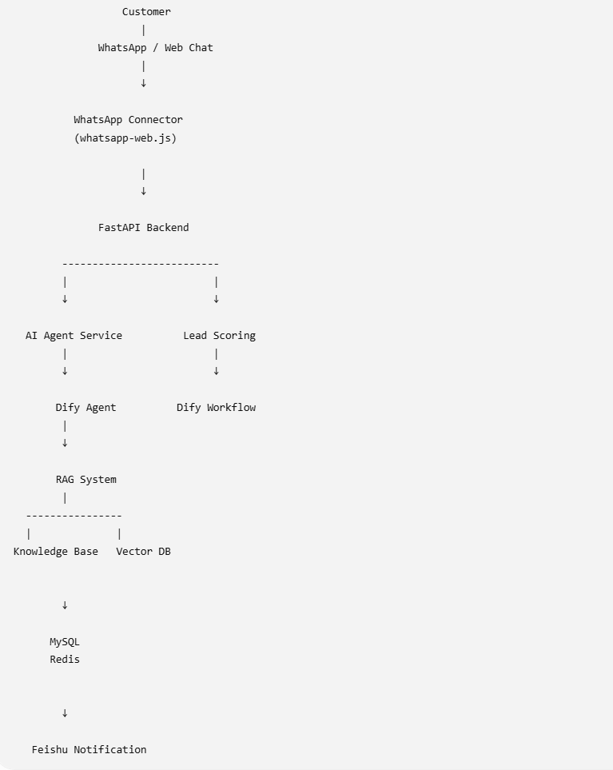
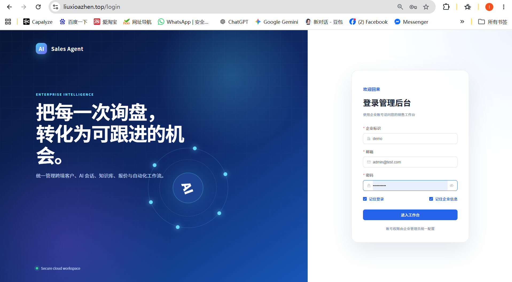
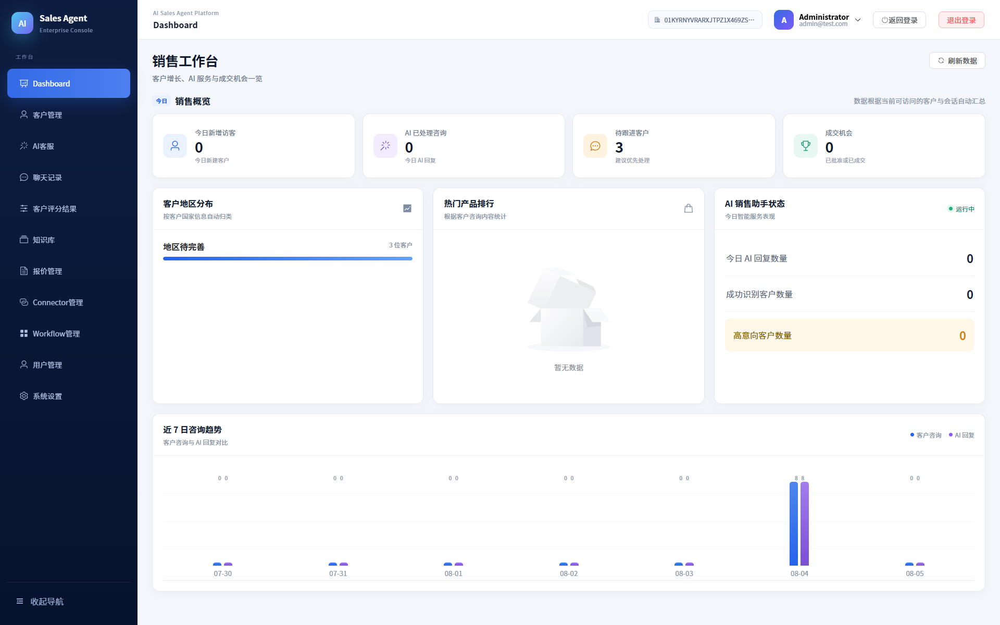
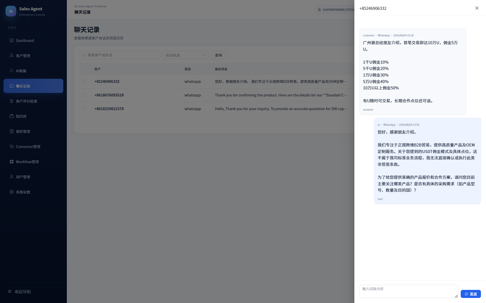
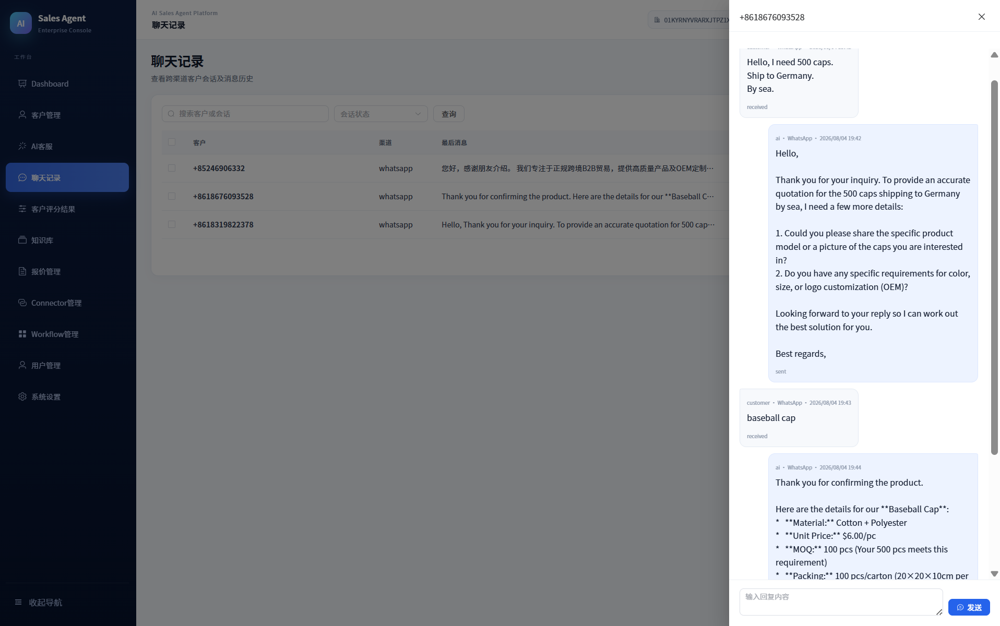
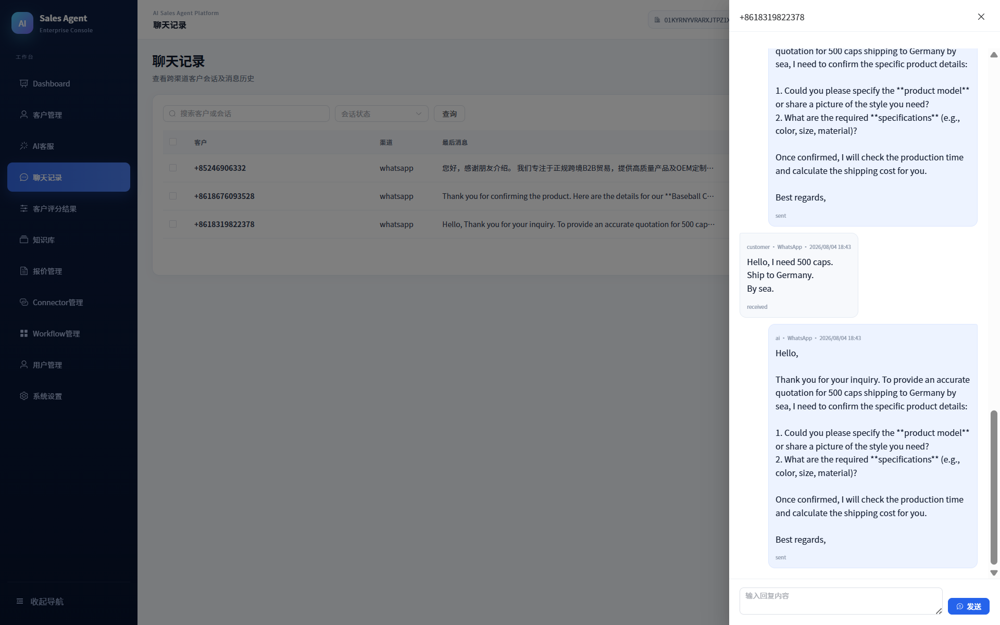
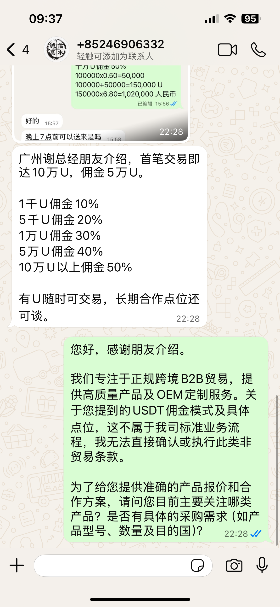
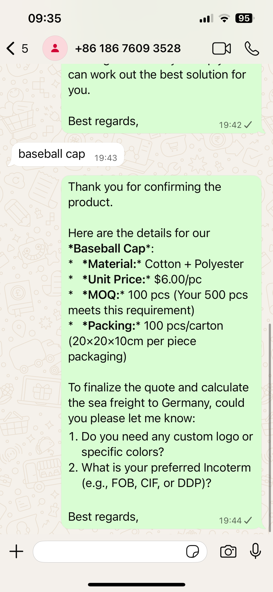
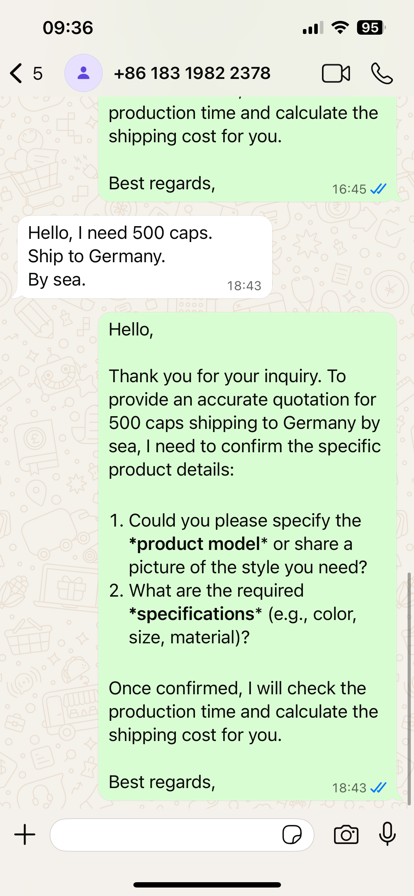
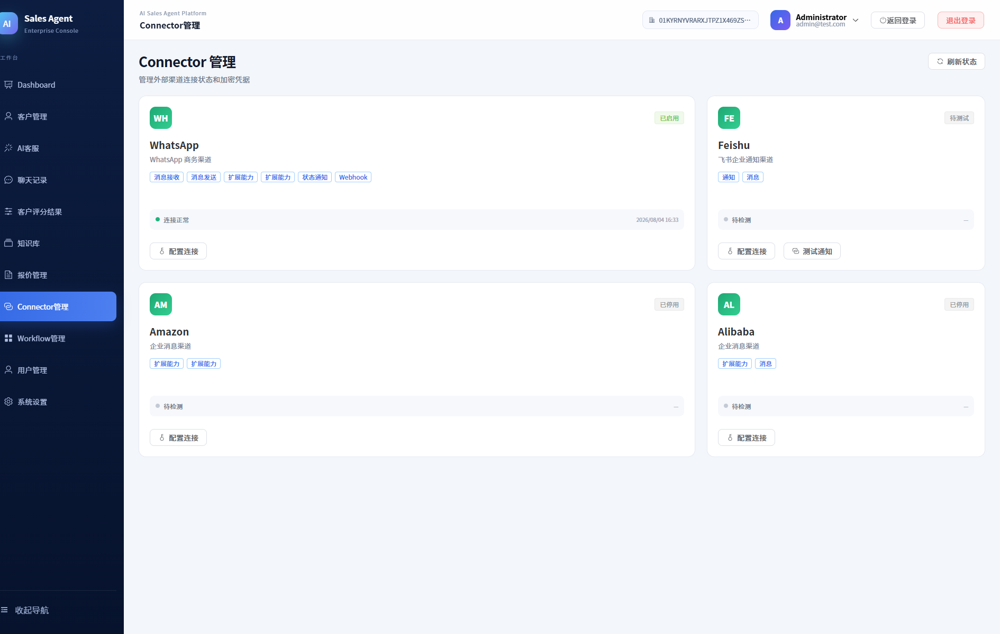
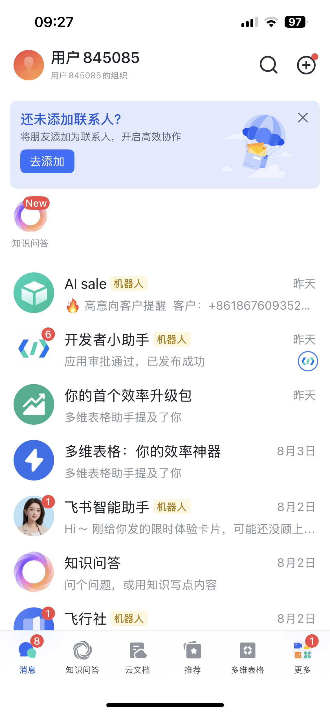
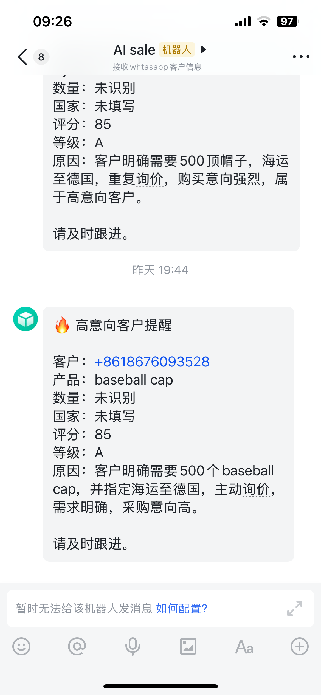
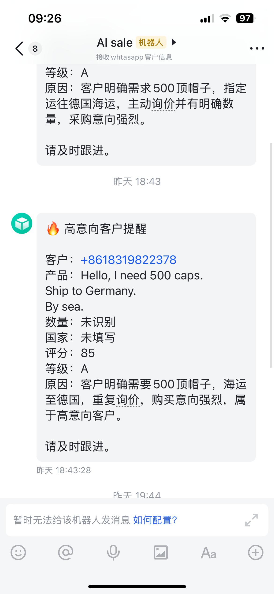
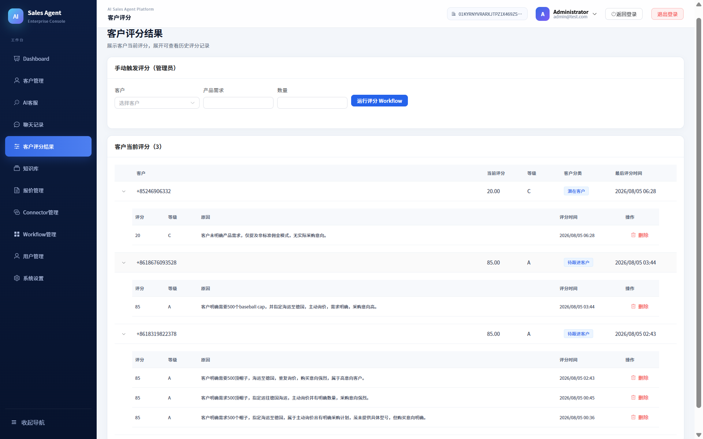
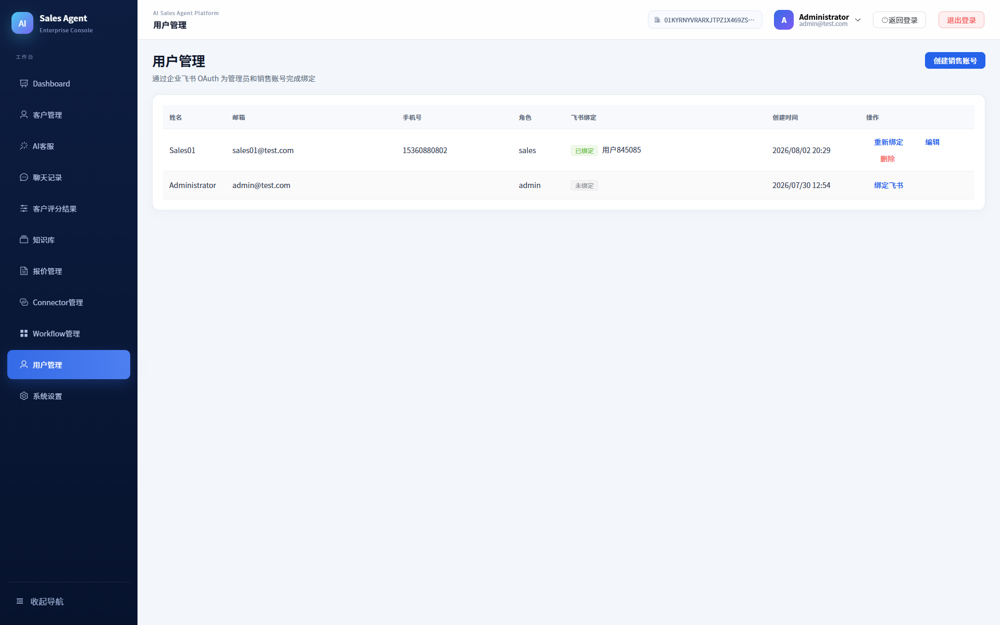
---

## Deployment

Docker Compose部署

---

## Future

- 更多渠道接入
- 自动报价
- CRM集成